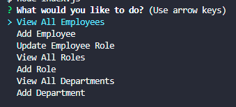

# Khievs-Employee-Tracker 
  ## Description
  This is a CMS interface or Employee Tracker. This is a command-line application that manages a company's employee database. The user will be able to track and manage the company's employees with this application.
  ## Table of Contents
  - [Installation](#installation)

  - [Usage](#usage)

  - [Credits](#credits)

  - [License](#license)

  - [Badges](#badges)

  - [Features](#features)

  - [Contribute](#contribute)

  - [Tests](#tests)

  ## Installation
  There is no installation. Clone the code from the github and the run via terminal.
  ## Usage
  [Github](https://github.com/ChrissnaKhiev/Khievs-Employee-Tracker)

  Insert data into the database via schema and seeds files.  Input into the terminal "node index.js" to start the command-line application.

  
  
  ## Credits
  None.
  ## License
    [https://github.com/ChrissnaKhiev/Khievs-Employee-Tracker/blob/main/LICENSE](https://github.com/ChrissnaKhiev/Khievs-Employee-Tracker/blob/main/LICENSE)
  ## Badges
  
  
  ## Features
  Keep track and manage employees.
  ## Contribute
  None.
  ## Tests
  None.